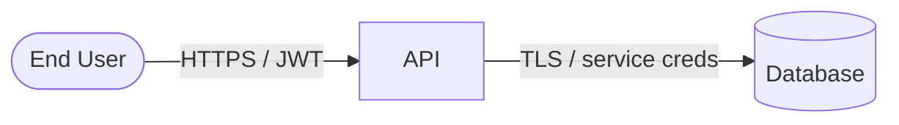

# threat-model/ Format

Threat modeling artifacts live under `threat-model/` at the repository root (unless multi-context layout applies — see SKILL.md).

Create directories lazily: first write creates `threat-model/`, `threat-model/threats/`, etc.

## File roles

| File | Purpose |
|------|---------|
| `THREAT-MODEL.md` | Index, scope, assumptions, risk profile, session state, version, summary |
| `system-model.md` | Assets, boundaries, flows, interactors, DFD |
| `threats/TM-NNN-slug.md` | One threat per file — see [THREAT-ENTRY-FORMAT.md](./THREAT-ENTRY-FORMAT.md) |

## THREAT-MODEL.md template

```markdown
# Threat Model — {Product or System Name}

## Metadata

| Field | Value |
|-------|-------|
| Version | 1 |
| Architecture baseline | `{git sha, tag, or link to arch doc version}` |
| Last full review | YYYY-MM-DD |
| In-scope | {bullets} |
| Out of scope | {bullets} |

## Risk profile

| Factor | Assessment |
|--------|------------|
| Exposure | {e.g. public internet, internal only, VPN} |
| Sensitive data | {e.g. PII, PHI, payment, secrets} |
| Compliance | {e.g. none, GDPR, SOC2, PCI} |
| Overall sensitivity | {low / medium / high / critical} |

## System assumptions

- {Assumption 1 — e.g. "All production traffic terminates at Cloudflare"}
- {Assumption 2}

**Provisional** assumptions (unconfirmed): {list or "none"}

## Session

| Field | Value |
|-------|-------|
| Status | `in-progress` \| `paused` \| `complete` |
| Last reviewed | TM-NNN or `none` |
| Next threat | TM-NNN |
| Paused at | YYYY-MM-DDTHH:MMZ (optional) |

### Open questions

- {Blocking question 1}

## Threat index

Sorted by severity (critical first). Link every file in `threats/`.

| ID | Title | Severity | STRIDE | Response | Implementation |
|----|-------|----------|--------|----------|----------------|
| [TM-001](./threats/TM-001-example.md) | Example title | High | Spoofing | Mitigate (planned) | non-mitigated |

**Response** = team decision (`avoid` / `mitigate` / `accept` / `transfer`). **Implementation** = `mitigation-state` from verified controls only — not from planned work.

## Summary (update after walkthrough or version bump)

Counts by **implementation** (`mitigation-state`), not by planned `response`.

| Severity | Total | Non-mitigated | Partial | Full | Response open |
|----------|-------|---------------|---------|------|---------------|
| Critical | 0 | 0 | 0 | 0 | 0 |
| High | 0 | 0 | 0 | 0 | 0 |
| Medium | 0 | 0 | 0 | 0 | 0 |
| Low | 0 | 0 | 0 | 0 | 0 |
| Informational | 0 | 0 | 0 | 0 | 0 |

**Response open** — `response` is `mitigate` or `avoid` but `mitigation-state` is not `fully-mitigated` (work still in Recommended actions).

### Residual risk (stakeholder view)

{Short narrative: top risks, accepted items, recommended next actions}

## Version history

| Version | Date | Reason |
|---------|------|--------|
| 1 | YYYY-MM-DD | Initial model |
```

## system-model

Use this structure in `system-model.md`:

```markdown
# System Model

## Scope

{What this model covers — align with THREAT-MODEL.md}

## Assets

| Asset | Type | Sensitivity | Location / store |
|-------|------|-------------|------------------|
| User credentials | Data | High | Auth service DB |

## Interactors

| Interactor | Type | Trust level | Notes |
|------------|------|-------------|-------|
| End user | Person | Untrusted | Browser |
| Operator | Person | Privileged | Admin console |

## Components

| Component | Role | Technology (if known) |
|-----------|------|------------------------|
| Web app | Frontend | {e.g. React} |
| API | Backend | {e.g. Node, Go} |

## Trust boundaries

| Boundary | Separates | Controls |
|----------|-----------|----------|
| Internet → DMZ | Public users from app tier | WAF, TLS |
| App → Data | Application from database | Network policy, IAM |

## Entry points

| ID | Entry | Protocol / interface | Auth |
|----|-------|----------------------|------|
| EP-1 | Public REST API | HTTPS / JSON | JWT |

## Exit points

| ID | Exit | Data leaving | Controls |
|----|------|--------------|----------|
| XP-1 | Backup to object storage | DB snapshots | Encryption, IAM |

## Data flows

| ID | From | To | Data | Direction | Protocol | Authn / Authz |
|----|------|-----|------|-----------|----------|---------------|
| DF-1 | Web app | API | Session token | → | HTTPS | OAuth bearer |

## Data flow diagram



## References

- {Link to CONTEXT.md, ADRs, arch diagrams, repos}
```

### System modeling checklist

Use when building or refreshing `system-model.md`:

1. **Scope identification** — product components and external entities
2. **Map components** — core building blocks on the DFD
3. **Data stores** — ephemeral and persistent storage
4. **External entities** — customers, admins, partner systems, public APIs
5. **Trust boundaries** — network, isolation, RBAC zones
6. **Data flows** — payload, direction, protocol, authentication/authorization

## Threat ID numbering

- Format: `TM-NNN-slug.md` (three digits, zero-padded)
- Scan `threat-model/threats/` for the highest `NNN` and increment
- Slug: lowercase, hyphens, derived from short title

## Archiving on version bump

When `version` increments in `THREAT-MODEL.md`:

```
threat-model/
├── archive/
│   └── v1/
│       ├── THREAT-MODEL.md
│       ├── system-model.md
│       └── threats/
```

Copy superseded artifacts or mark threats `status: superseded` with `superseded-by: TM-NNN` in frontmatter.
